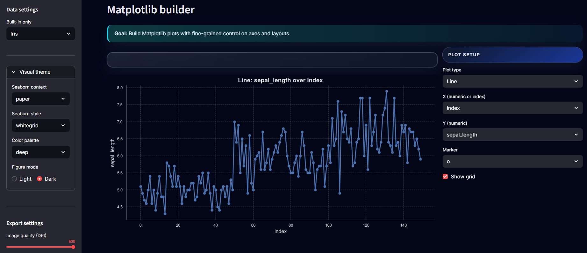
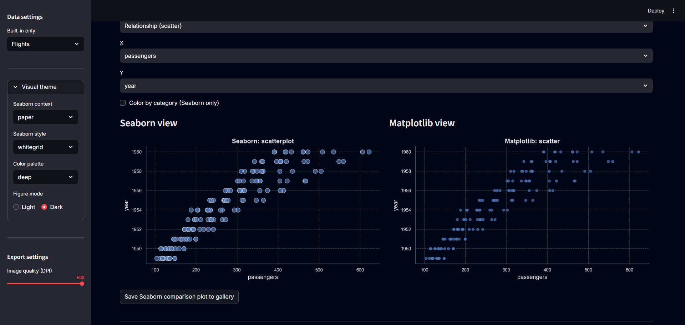

# 📊 Seaborn & Matplotlib Visual Lab

[](https://streamlit.io/)
[](https://www.python.org/)
[](LICENSE)
[](https://github.com/tarekmasryo)

An interactive **Streamlit** lab for learning and comparing **Seaborn** and **Matplotlib** — build plots from UI controls, inspect the generated code, and export clean PNGs (or a ZIP gallery).

---

## 🧪 What this app does

This app is a **visual lab for plots**:

- Load classic **Seaborn demo datasets** in one click (Tips, Penguins, Flights, Iris, Diamonds, Titanic, Car Crashes).
- Build **Seaborn** charts (distribution, relationship, category, heatmaps, pairplots) through simple UI controls.
- Recreate the same patterns with **Matplotlib** to understand the low-level API.
- Compare Seaborn vs Matplotlib **side by side** on the same visualization idea.
- Save figures to a **gallery** and export PNGs or a ZIP archive.

Perfect for **learning**, **teaching**, and **quick EDA prototypes**.

---

## 🧭 App structure

| Tab | Purpose |
|:---|:--------|
| **Overview** | Quick dataset health check: sample, dtypes, missingness, and a small correlation view. |
| **Seaborn builder** | UI-driven Seaborn plots + auto-updating Python snippet. |
| **Matplotlib builder** | Low-level Matplotlib plots with control over axes, grids, and layout. |
| **Compare** | Same idea shown once with Seaborn and once with Matplotlib. |
| **Gallery** | Saved figures, PNG download, and ZIP export. |

---

## 📚 Data sources

All datasets come from **Seaborn’s built-in catalog** (no external files needed):

- `tips`
- `penguins` (cleaned)
- `flights`
- `iris`
- `diamonds` (sample)
- `titanic`
- `car_crashes`

---

## 📸 Dashboard preview

### 1️⃣ Seaborn — Distribution Builder (Tips)

<p align="center">
  
</p>

---

### 2️⃣ Seaborn — Relationship Builder (Tips)

<p align="center">
  
</p>

---

### 3️⃣ Matplotlib — Histogram (Iris)

<p align="center">
  
</p>

---

### 4️⃣ Matplotlib — Line Plot (Iris)

<p align="center">
  
</p>

---

### 5️⃣ Compare — Histogram + KDE (Tips)

<p align="center">
  
</p>

---

### 6️⃣ Compare — Scatter (Flights)

<p align="center">
  
</p>

---

## 🚀 Quick start (local)

### Option A — Windows (PowerShell)

```bash
git clone https://github.com/tarekmasryo/seaborn-matplotlib-visual-lab.git
cd seaborn-matplotlib-visual-lab

py -3.11 -m venv .venv
Set-ExecutionPolicy -Scope Process -ExecutionPolicy Bypass
.\.venv\Scripts\Activate.ps1

python -m pip install -U pip
python -m pip install -r requirements.txt
python -m pip install -r requirements-dev.txt

python -m streamlit run app.py
```

Open: http://localhost:8501

### Option B — Linux / macOS

```bash
git clone https://github.com/tarekmasryo/seaborn-matplotlib-visual-lab.git
cd seaborn-matplotlib-visual-lab

python3 -m venv .venv
source .venv/bin/activate

python -m pip install -U pip
python -m pip install -r requirements.txt
python -m pip install -r requirements-dev.txt

python -m streamlit run app.py
```

---

## ✅ Development workflow (the kit)

This repo ships with a lightweight **quality kit**:
- **ruff** for linting/formatting
- **pytest** for tests (smoke checks)
- **pre-commit** hooks to enforce style locally
- **GitHub Actions** workflow(s) under `.github/workflows/` to run checks on PRs

### Lint & format

```bash
python -m ruff check . --fix
python -m ruff format .
```

### Tests

```bash
python -m pytest -q
```

### Pre-commit (recommended)

```bash
pre-commit install
pre-commit run --all-files
```

---

## 📁 Project structure

```text
.
├─ app.py
├─ requirements.txt
├─ requirements-dev.txt
├─ tests/
├─ assets/                 # README screenshots
└─ .github/workflows/      # CI pipelines (optional)
```

---

## 🧠 Notes (production-minded)

- Keep heavy computation inside functions (avoid expensive work at import-time).
  This keeps tests fast and avoids slow CI runs.
- Major dependency bumps (e.g., Plotly 5 → 6) should be validated by running the app
  and checking all chart tabs before merging.

---

## 📜 License

Apache-2.0 — see [LICENSE](LICENSE).

---

## 👤 Author

Tarek Masryo
