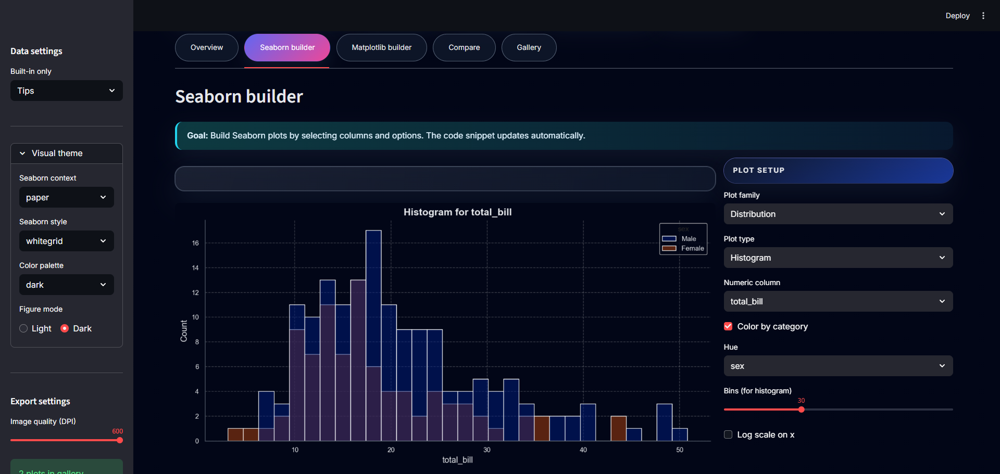
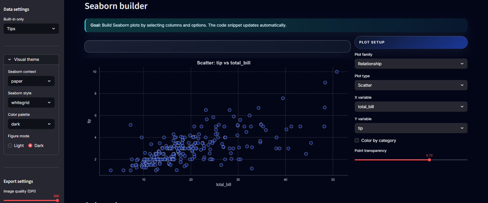
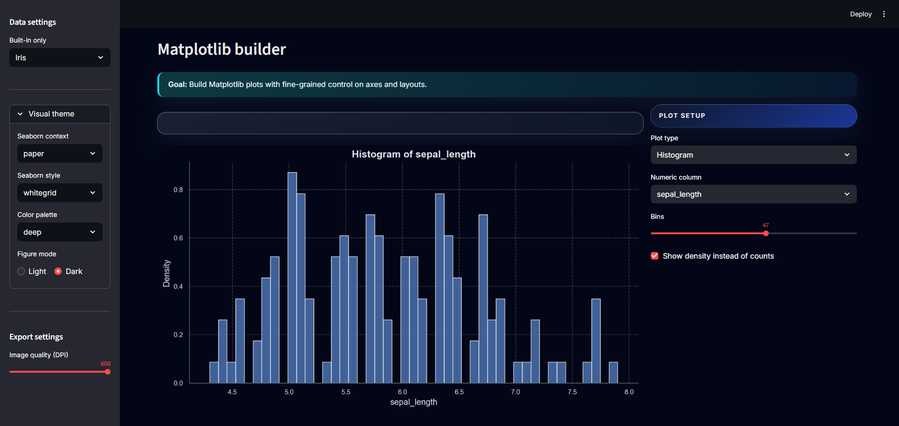
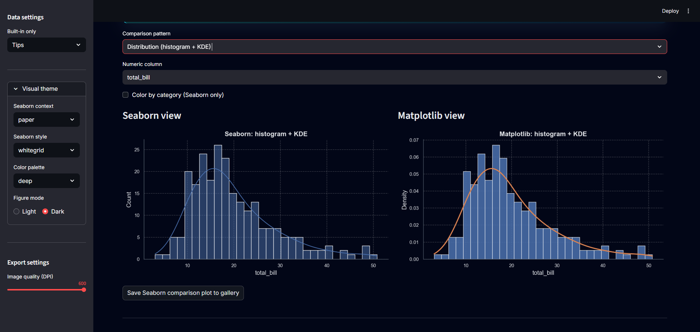

# 📊 Seaborn & Matplotlib Visual Lab

[](https://streamlit.io/)
[](https://www.python.org/)
[](LICENSE)

An interactive **Streamlit** lab to learn and compare **Seaborn** and **Matplotlib**. Build plots from UI controls, inspect the generated code, and export clean PNGs or a ZIP gallery.

---

## 🧪 What this app does

- Load classic **Seaborn example datasets** in one click: Tips, Penguins, Flights, Iris, Diamonds, Titanic, and Car Crashes.
- Build **Seaborn** charts using simple controls: distributions, relationships, categories, heatmaps, and pairplots.
- Recreate similar visualization ideas with **Matplotlib** to understand the lower-level plotting API.
- Compare **Seaborn vs Matplotlib** side by side.
- Save figures to a **gallery** and export PNGs or a ZIP archive.

**Offline-friendly:** if Seaborn’s online dataset catalog cannot be reached, the app falls back to a small built-in dataset to keep the UI usable.

---

## 🧭 App structure

| Tab | Purpose |
|:---|:--------|
| **Overview** | Dataset health check: sample rows, dtypes, missingness, and a small correlation view. |
| **Seaborn builder** | UI-driven Seaborn plots with an auto-updating Python snippet. |
| **Matplotlib builder** | Lower-level Matplotlib plots with control over axes, grids, and layout. |
| **Compare** | Same visualization idea shown with Seaborn and Matplotlib. |
| **Gallery** | Saved figures, PNG download, and ZIP export. |

---

## 📚 Data sources

Datasets are pulled from **Seaborn’s built-in catalog**:

- `tips`
- `penguins`
- `flights`
- `iris`
- `diamonds` (sample)
- `titanic`
- `car_crashes`

---

## 📸 Dashboard preview

<p align="center">
  
</p>

<p align="center">
  
</p>

<p align="center">
  
</p>

<p align="center">
  
</p>

---

## 🚀 Quick start

### Option A — Windows PowerShell

```powershell
git clone https://github.com/tarekmasryo/seaborn-matplotlib-visual-lab.git
cd seaborn-matplotlib-visual-lab

py -3.11 -m venv .venv
Set-ExecutionPolicy -Scope Process -ExecutionPolicy Bypass
.\.venv\Scripts\Activate.ps1

python -m pip install -U pip
python -m pip install -r requirements.txt

python -m streamlit run app.py
```

Open: http://localhost:8501

### Option B — Linux / macOS

```bash
git clone https://github.com/tarekmasryo/seaborn-matplotlib-visual-lab.git
cd seaborn-matplotlib-visual-lab

python3 -m venv .venv
source .venv/bin/activate

python -m pip install -U pip
python -m pip install -r requirements.txt

python -m streamlit run app.py
```

Open: http://localhost:8501

---

## ✅ Tooling & workflow

This repo ships with lightweight quality gates:

- **ruff** for linting and formatting
- **pytest** for smoke tests
- **pre-commit** hooks for local consistency
- **GitHub Actions** workflows under `.github/workflows/` to validate PRs and Docker builds

Install development dependencies:

```bash
python -m pip install -r requirements-dev.txt
```

### Lint & format

```bash
python -m ruff check . --fix
python -m ruff format .
```

### Tests

```bash
python -m pytest tests -q
```

### Pre-commit

```bash
pre-commit install
pre-commit run --all-files
```

---

## 🧩 Case study

Read the case study: [CASE_STUDY.md](CASE_STUDY.md)

---

## 📦 Docker

```bash
docker build -t visual-lab .
docker run --rm -p 8501:8501 visual-lab
```

Open: http://localhost:8501

---

## 📁 Project structure

```text
.
├─ app.py
├─ visual_lab_core.py      # Pure helpers tested outside Streamlit
├─ requirements.txt
├─ requirements-dev.txt
├─ CHANGELOG.md
├─ CASE_STUDY.md
├─ Dockerfile
├─ tests/
├─ assets/                 # README screenshots
└─ .github/workflows/      # CI workflows
```

---

## 🧠 Notes

- Avoid expensive work at import time; keep heavy work inside functions. This keeps tests fast and CI stable.
- For major dependency bumps, run the app and click through all tabs before merging.
- If Seaborn’s online dataset catalog is unavailable, the app uses a small fallback dataset so the interface remains usable.

---

## 📜 License

Apache-2.0 — see [LICENSE](LICENSE).

---

## 👤 Author

**Tarek Masryo** — AI/ML Engineer

GitHub: [@tarekmasryo](https://github.com/tarekmasryo) · Kaggle: [@tarekmasryo](https://www.kaggle.com/tarekmasryo) · Portfolio: [tarekmasryo.github.io](https://tarekmasryo.github.io)
